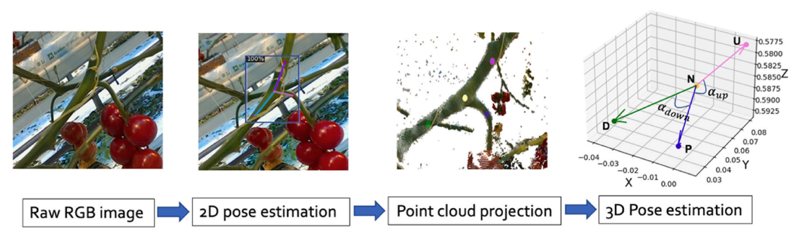
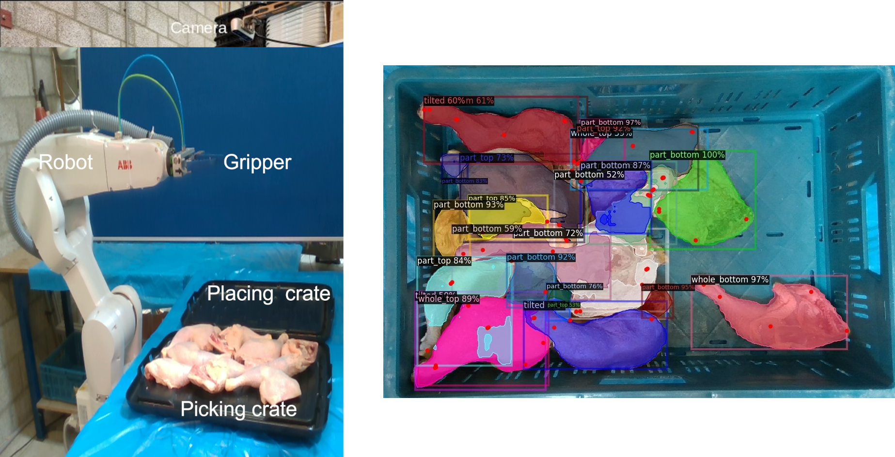

# Robotics and Computer Vision Engineer

## Education
- **Ph.D. Candidate, Robotics and Computer Vision** (_2025_)  
  Title: Active Vision for Agricultural Robotics  
  Wageningen University and Research, The Netherlands							       		
- **M.Sc., Systems Control and Robotics** (_Sep 2017_)  
  KTH Royal Institute of Technology, Sweden 
- **B.Sc., Electrical and Electronics Engineering** (_May 2017_)  
  Anna University, India 

## Skills
- **Software**: Robotics Operating System (ROS/ROS2), MoveIt, OpenCV, Open3D, COLMAP, Version control with Git, Containerisation with Docker, Linux
- **Coding**: C++, Python, MATLAB
- **Hardware**: Nvidia Jetson Orin, ABB 6DoF manipulator, OAK-D RGB-D camera, Realsense RGB-D and LiDAR cameras, Robotiq 2-finger gripper
- **Languages**: English (full professional proficiency), Telugu (native), Tamil, Hindi, interested in learning Dutch, German (had B1 proficiency in the past)

## Work Experience
**AI and Computer Vision Engineer** (_Apr 2025 - Present_)  
**Track32, The Netherlands**
- Designed and implemented ROS2-based perception modules for industrial and agricultural machines, ensuring reliable performance in real-world outdoor environments
- Developed software logic for multi-sensor data aggregation and spatial reasoning from stereo and RGB-D inputs
- Developed and deployed C++ and Python applications on Linux platforms (Jetson Orin, Hailo AI) for edge inference and real-time monitoring
- Built containerized systems (Docker) for scalable deployment and field operation, improving maintainability and performance
- Led software design architecture, coordinated integration with other engineers, and maintained version-controlled modular codebases on git
- Collaborated closely with clients and cross-functional teams to gather requirements, perform data collection and field validation, and ensure robust system performance under variable conditions
- Areas/Skills: Computer vision, ROS2, 3D point cloud, C++, Python, Docker containerisation, Git

**PhD Candidate** (_Oct 2019 - Aug 2024_)  
**Wageningen University and Research, The Netherlands**
- Developed autonomous visual control algorithms for a robotic tomato harvester, enabling perception-guided manipulation and motion planning in real greenhouse environments
- Implemented real-time perception and control pipelines in C++ and Python (ROS1) for collaborative research teams, including inter-module communication, state management, and command execution
- Designed active vision strategies for next-best-view planning, a closed-loop system combining perception, decision-making, and control
- Conducted field experiments in operational greenhouses to validate system reliability, robustness, and safety under dynamic conditions
- Managed software versioning, integration, and testing for a team of 10+ researchers using Git
- Assisted junior PhD candidates and MSc BSc students with their research
- Areas/Skills: Viewpoint control, Active exploration, Deep learning and AI, Version control, Scientific writing, Teaching and supervision, C++, Python, ROS

**Robotics Software Developer** (_Oct 2017 - Sep 2019_)  
**Geo-konzept GmbH, Germany**
- Developed real-time localization and mapping software for GPS-denied forest environments using C++ and ROS
- Implemented a visual–inertial odometry (VIO) control and state estimation algorithm that enabled autonomous navigation of heavy forestry machinery
- Built tools to process multispectral drone imagery and reconstruct georeferenced 2D maps for precision agriculture and environmental monitoring
- Worked closely with hardware engineers to integrate and test software in field conditions, ensuring reliability under harsh outdoor environments
- Areas/Skills: Localisation, Image processing, Computer vision, C++, ROS

## Projects
### Active vision for robotic harvesting and de-leafing of tomato plants
Robotic harvesting and de-leafing is extremely challenging due to occlusion of plant parts by leaves. I designed multiple novel algorithms in my PhD to address the challenge of occlusion and improve the perception of plant parts by robots. The algorithms use active vision, a strategy to intelligently plan the camera viewpoints such that occlusion can be avoided and perception can be improved.

### Detection and pose estimation of fruit and leaf node for automated harvesting and de-leafing
For automated harvesting and de-leafing of plants, robots need to detect the fruit and leaf nodes and estimate their pose. The pose is used by the robot to appraoch the node and make a cut. In this project, I worked on a deep learning algorithm to identify the semantic mask and keypoints of the fruit and leaf nodes. The keypoints were then projected to 3D to estimate the pose of the nodes. This approach was tested and shown to work really well in a tomato greenhouse. It can potentially lead to high success rates in robotic harvesting and de-leafing.

### Pose estimation of chicken pieces for robotic pick-and-place
Automated picking and placing of chicken pieces using a robot is extremely challenging due to their deformable and slippery nature. For successful pick-and-place operation, the robot must grasp the chicken pieces at rigid and stable parts of the chicken piece. For this, it is important to detect the chicken pieces and estimate their pose and keypoints, which can then be used for grasping. In this project, I helped with a deep learning network to detect the keypoints and estimate the pose of chicken pieces. The pick and place operation was tested in an ABB 6DoF robotic arm with a 2-finger gripper.

## Publications
#### Peer-reviewed journal publications
- **Burusa, A. K.**, Scholten, J., Wang, X., Rapado-Rincon, D., van Henten, E. J., & Kootstra, G. (2024). **Semantics-aware next-best-view planning for efficient search and detection of task-relevant plant parts**. Biosystems Engineering, 248 , 1–14. doi: [10.1016/j.biosystemseng.2024.09.018](https://doi.org/10.1016/j.biosystemseng.2024.09.018)
- **Burusa, A. K.**, van Henten, E. J., & Kootstra, G. (2024). **Attention-driven next-best-view planning for efficient reconstruction of plants and targeted plant parts**. Biosystems Engineering, 246 , 248–262. doi: [10.1016/j.biosystemseng.2024.08.002](https://doi.org/10.1016/j.biosystemseng.2024.08.002)
- Rapado-Rincon, D., **Burusa, A. K.**, van Henten, E. J., & Kootstra, G. (2024). **A comparison between single-stage and two-stage 3d tracking algorithms for greenhouse robotics**. Sensors, 24(22), 7332. doi: [10.3390/s24227332](https://doi.org/10.3390/s24227332)
- Raja, R., **Burusa, A. K.**, Kootstra, G., & Van Henten, E. J. (2024). **Advanced robotic system for efficient pick-and-place of deformable poultry in cluttered bin: A comprehensive evaluation approach**. IEEE Transactions on AgriFood Electronics, 2 , 355–371. doi: [10.1109/TAFE.2024.3379190](https://doi.org/10.1109/TAFE.2024.3379190)
- Ci, J., Wang, X., Rapado-Rincon, D., **Burusa, A. K.**, & Kootstra, G. (2024). **3d pose estimation of tomato peduncle nodes using deep keypoint detection and point cloud**. Biosystems Engineering, 243 , 57–69. doi: [10.1016/j.biosystemseng.2024.04.017](https://doi.org/10.1016/j.biosystemseng.2024.04.017)
- Senden, J., Hollands, K., Rapado-Rincon, D., **Burusa, A. K.**, Herremans, B., Bruyninckx, H., & Van De Molengraft, R. (2023). **Multi-hypothesis tracking in a graph-based world model for knowledge-driven active perception**. IEEE Robotics and Automation Letters, 8 , 5934–5941. doi: [10.1109/LRA.2023.3300282](https://doi.org/10.1109/LRA.2023.3300282)

#### Peer-reviewed conference publications
- **Burusa, A. K.**, van Henten, E. J., & Kootstra, G. (2024). **Gradient-based local next-best-view planning for improved perception of targeted plant nodes**. In 2024 IEEE International Conference on Robotics and Automation (ICRA) (pp. 15854–
15860). IEEE. doi: [10.1109/ICRA57147.2024.10610397](https://doi.org/10.1109/ICRA57147.2024.10610397)

#### Peer-reviewed journal submissions
- Wang, X., **Burusa, A. K.**, Rapado-Rincon, D., Versmissen, T. A. W., van Henten, E. J., & Kootstra, G. (2024). **Multiple object tracking with multi-view active vision to effectively find plant nodes in a cluttered tomato greenhouse**. Submitted for publication in Computers and Electronics in Agriculture
- Ci, J., Wang, X., **Burusa, A. K.**, Henten, E. J. v., & Kootstra, G. (2024). **Ssl-nbv: A self-supervised-learning-based next-best-view algorithm for efficient 3d plant reconstruction by a robot**. Submitted for publication in Computers and Electronics in Agriculture
- Raja, R., Pacheco, L. A. P., **Burusa, A. K.**, van Henten, E. J., & Kootstra, G. (2024). **Real-time 6-dof grasping of deformable poultry legs in cluttered bins using deep learning and geometric feature extraction**. Submitted for publication in Computers and Electronics in Agriculture
