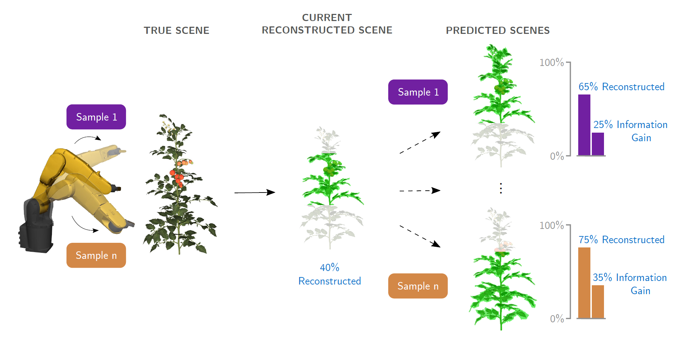

# Robotics and Computer Vision Engineer

## Skills
- **Software Skills**: ROS, PyTorch, Open3D, COLMAP, Git, Gazebo, Webots
- **Coding Skills**: Python, C++, MATLAB
- **Hardware Skills**: ABB 6DoF manipulator, Intel Realsense RGB-D cameras, Robotiq 2-finger gripper

## Education
- **Ph.D. Candidate, Computer Vision and Robotics** (_2025_)	  
  Wageningen University and Research, The Netherlands							       		
- **M.Sc., Systems Control and Robotics** (_Sep 2017_)  
  KTH Royal Institute of Technology, Sweden 
- **B.Sc., Electrical and Electronics Engineering** (_May 2017_)  
  Anna University, India 

## Work Experience
**PhD Candidate** (_Oct 2019 - Aug 2024_)  
**Wageningen University and Research, The Netherlands**
- Addressed the challenge of occlusion, which is a major reason of failure for harvesting and de-leafing robots
- Developed active vision strategies that enabled robots to plan camera viewpoints that were occlusion-free and improved the efficiency and accuracy of perception
- Tested the active vision strategies in a tomato greenhouse and showed that it outperformed traditional methods

**Robotics Software Developer** (_Oct 2017 - Sep 2019_)  
**Geo-konzept GmbH, Germany**
- Applied autonomous vehicle and computer vision technology to agricultural and forestry applications
- Developed software to reconstruct 2D crop-quality map of farms by geometrically correcting and aligning multi-spectral drone images
- Developed a visual-inertial odometry algorithm to track the position of a wood harvesting vehicle under dense forest cover when GPS was unreliable

## Projects
### Active vision for robotic harvesting and de-leafing of tomato plants
Robotic harvesting and de-leafing is extremely challenging due to occlusion of plant parts by leaves. Designed multiple novel algorithms in my PhD to address the challenge of occlusion and improve the perception of plant parts by robots. The algorithms use active vision, a strategy to intelligently plan the camera viewpoints such that occlusion can be avoided and perception can be improved.

### Detection and pose estimation of fruit and lead node for automated harvesting and de-leafing

### Pose estimation of chicken pieces for robotic pick-and-place

## Publications
#### Peer-reviewed journal publications
- **Burusa, A. K.**, Scholten, J., Wang, X., Rapado-Rincon, D., van Henten, E. J., & Kootstra, G. (2024). Semantics-aware next-best-view planning for efficient search and detection of task-relevant plant parts. Biosystems Engineering, 248 , 1–14. doi: [10.1016/j.biosystemseng.2024.09.018](https://doi.org/10.1016/j.biosystemseng.2024.09.018)
- **Burusa, A. K.**, van Henten, E. J., & Kootstra, G. (2024). Attention-driven next-best-view planning for efficient reconstruction of plants and targeted plant parts. Biosystems Engineering, 246 , 248–262. doi: [10.1016/j.biosystemseng.2024.08.002](https://doi.org/10.1016/j.biosystemseng.2024.08.002)
- Rapado-Rincon, D., **Burusa, A. K.**, van Henten, E. J., & Kootstra, G. (2024). A comparison between single-stage and two-stage 3d tracking algorithms for greenhouse robotics. Sensors, 24(22), 7332. doi: [10.3390/s24227332](https://doi.org/10.3390/s24227332)
- Raja, R., **Burusa, A. K.**, Kootstra, G., & Van Henten, E. J. (2024). Advanced robotic system for efficient pick-and-place of deformable poultry in cluttered bin: A comprehensive evaluation approach. IEEE Transactions on AgriFood Electronics, 2 , 355–371. doi: [10.1109/TAFE.2024.3379190](https://doi.org/10.1109/TAFE.2024.3379190)
- Ci, J., Wang, X., Rapado-Rincon, D., **Burusa, A. K.**, & Kootstra, G. (2024). 3d pose estimation of tomato peduncle nodes using deep keypoint detection and point cloud. Biosystems Engineering, 243 , 57–69. doi: [10.1016/j.biosystemseng.2024.04.017](https://doi.org/10.1016/j.biosystemseng.2024.04.017)
- Senden, J., Hollands, K., Rapado-Rincon, D., **Burusa, A. K.**, Herremans, B., Bruyninckx, H., & Van De Molengraft, R. (2023). Multi-hypothesis tracking in a graph-based world model for knowledge-driven active perception. IEEE Robotics and
Automation Letters, 8 , 5934–5941. doi: [10.1109/LRA.2023.3300282](https://doi.org/10.1109/LRA.2023.3300282)

#### Peer-reviewed conference publications
- **Burusa, A. K.**, van Henten, E. J., & Kootstra, G. (2024). Gradient-based local next-best-view planning for improved perception of targeted plant nodes. In 2024 IEEE International Conference on Robotics and Automation (ICRA) (pp. 15854–
15860). IEEE. doi: [10.1109/ICRA57147.2024.10610397](https://doi.org/10.1109/ICRA57147.2024.10610397)

#### Peer-reviewed journal submissions
- Wang, X., **Burusa, A. K.**, Rapado-Rincon, D., Versmissen, T. A. W., van Henten, E. J., & Kootstra, G. (2024). Multiple object tracking with multi-view active vision to effectively find plant nodes in a cluttered tomato greenhouse. Submitted for publication in Computers and Electronics in Agriculture
- Ci, J., Wang, X., **Burusa, A. K.**, Henten, E. J. v., & Kootstra, G. (2024). Ssl-nbv: A self-supervised-learning-based next-best-view algorithm for efficient 3d plant reconstruction by a robot. Submitted for publication in Computers and Electronics in Agriculture
- Raja, R., Pacheco, L. A. P., **Burusa, A. K.**, van Henten, E. J., & Kootstra, G. (2024). Real-time 6-dof grasping of deformable poultry legs in cluttered bins using deep learning and geometric feature extraction. Submitted for publication in Computers and Electronics in Agriculture
